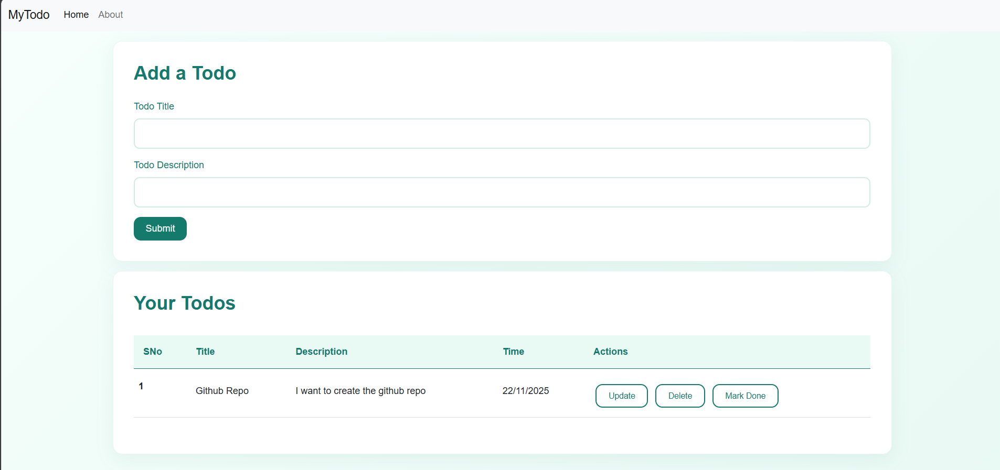

# flask-todo-app


## 📝 Description

Organize your life with **flask-todo-app**, a sleek and responsive task management web application meticulously crafted with Flask and Bootstrap 5. This isn't just another to-do list; it's a comprehensive tool designed to help you master your tasks and boost your productivity. 

Dive into full CRUD (Create, Read, Update, Delete) operations, effortlessly managing your tasks from inception to completion. Visually track your progress with intuitive feedback, providing you with a clear overview of your accomplishments. Built upon a foundation of SQLite database persistence via SQLAlchemy, your data is reliably stored and readily accessible. 

Experience a modern, visually appealing teal-themed UI that makes task management a joy. flask-todo-app is not only a practical tool for personal organization but also an invaluable resource for developers seeking to learn Flask fundamentals and build real-world web applications. Whether you're a seasoned developer or just starting out, this project offers a hands-on approach to understanding web development best practices.

## ✨ Features

- ✅ **Create Tasks** - Add new tasks with title and description
- ✅ **Update Tasks** - Edit existing tasks anytime
- ✅ **Delete Tasks** - Remove completed or unnecessary tasks
- ✅ **Mark Complete** - Track task completion with visual feedback and strike-through effects
- ✅ **Persistent Storage** - All tasks saved in SQLite database
- ✅ **Responsive Design** - Works seamlessly on desktop, tablet, and mobile
- ✅ **Modern UI** - Beautiful teal-themed interface with Bootstrap 5
- ✅ **Date Tracking** - Automatically tracks task creation dates

## 📸 Screenshots



## 🛠️ Tech Stack

- **Backend:** Python 3.8+, Flask 3.1.2
- **Frontend:** HTML5, CSS3, Bootstrap 5
- **Database:** SQLite with SQLAlchemy ORM
- **Template Engine:** Jinja2

## 📦 Key Dependencies

```
blinker==1.9.0
click==8.3.1
colorama==0.4.6
Flask==3.1.2
Flask-SQLAlchemy==3.1.1
greenlet==3.2.4
itsdangerous==2.2.0
Jinja2==3.1.6
MarkupSafe==3.0.3
SQLAlchemy==2.0.44
typing_extensions==4.15.0
Werkzeug==3.1.3
```

## 📁 Project Structure

```
flask-todo-app/
├── app.py                 # Main Flask application
├── requirements.txt       # Python dependencies
├── README.md             # Project documentation
├── static/               # Static files
│   └── css/
│       ├── about.css     # About page styles
│       └── style.css     # Main stylesheet
└── templates/            # HTML templates
    ├── about.html        # About page
    ├── base.html         # Base template
    ├── index.html        # Home page with todo list
    └── update.html       # Task update page
```

## 🚀 Quick Start

### Prerequisites

- Python 3.8 or higher installed on your system
- Git (optional, for cloning)

### Installation

1. **Clone the repository:**
   ```bash
   git clone https://github.com/Mahii0107/flask-todo-app.git
   cd flask-todo-app
   ```

2. **Create and activate virtual environment:**
   
   **Windows:**
   ```bash
   python -m venv env
   env\Scripts\activate
   ```
   
   **Mac/Linux:**
   ```bash
   python3 -m venv env
   source env/bin/activate
   ```

3. **Install dependencies:**
   ```bash
   pip install -r requirements.txt
   ```

4. **Initialize the database:**
   ```bash
   python
   >>> from app import db
   >>> db.create_all()
   >>> exit()
   ```

5. **Run the application:**
   ```bash
   python app.py
   ```

6. **Open your browser:**
   
   Navigate to `http://localhost:5000`

## 🎯 Usage

1. **Add a Task:** Fill in the title and description, then click "Submit"
2. **Mark as Complete:** Click the "Mark Done" button to mark tasks as completed
3. **Update a Task:** Click "Update" to edit task details
4. **Delete a Task:** Click "Delete" to remove a task permanently

## 🛠️ Development Setup

### Setting Up for Development

1. **Fork the repository** on GitHub

2. **Clone your fork:**
   ```bash
   git clone https://github.com/YOUR-USERNAME/flask-todo-app.git
   cd flask-todo-app
   ```

3. **Create a virtual environment:**
   ```bash
   python -m venv env
   env\Scripts\activate  # Windows
   source env/bin/activate  # Mac/Linux
   ```

4. **Install dependencies:**
   ```bash
   pip install -r requirements.txt
   ```

5. **Run in debug mode:**
   ```bash
   python app.py
   ```
   The app runs in debug mode by default, with auto-reload enabled.

### Database Management

- **Create tables:** Run `db.create_all()` in Python shell
- **Reset database:** Delete `todo.db` file and recreate tables
- **Database location:** `todo.db` in the project root (ignored by Git)

## 👥 Contributing

Contributions are welcome! Here's how you can help:

1. **Fork** the repository
2. **Clone** your fork: 
   ```bash
   git clone https://github.com/YOUR-USERNAME/flask-todo-app.git
   ```
3. **Create** a new branch: 
   ```bash
   git checkout -b feature/your-feature-name
   ```
4. **Make your changes** and commit: 
   ```bash
   git commit -am 'Add some feature'
   ```
5. **Push** to your branch: 
   ```bash
   git push origin feature/your-feature-name
   ```
6. **Open** a Pull Request

### Contribution Guidelines

- Follow PEP 8 style guidelines for Python code
- Write clear, descriptive commit messages
- Test your changes thoroughly before submitting
- Update documentation as needed
- Add comments for complex logic

## 🐛 Known Issues

- None at the moment! Found a bug? Please open an issue.

## 📄 License

This project is licensed under the MIT License - feel free to use it for learning and personal projects.

## 🙏 Acknowledgments

- Built with [Flask](https://flask.palletsprojects.com/)
- Styled with [Bootstrap 5](https://getbootstrap.com/)
- Database management via [SQLAlchemy](https://www.sqlalchemy.org/)

## 📧 Contact

Created by [@Mahii0107](https://github.com/Mahii0107) - feel free to reach out!

---

⭐ **Star this repository if you find it helpful!**

Made using Flask and Bootstrap